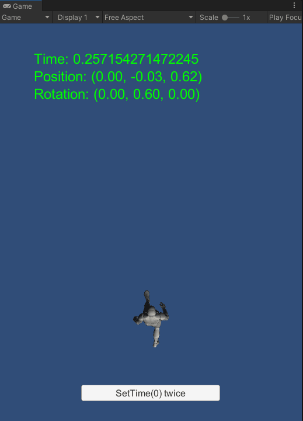
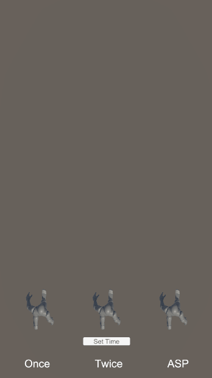
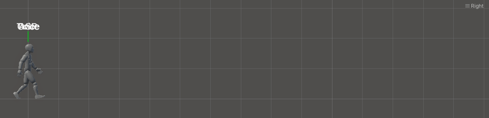

# [Won't Fix] Unity-Bug-Report-Playable-IN-36756

**Unity has stated that they will not fix this bug.**

> RESOLUTION NOTE:
> After evaluating the impact, workaround and risk associated with fixing this issue, in addition to the current team's bandwidth and priorities, we have concluded that this issue will not be addressed in the foreseeable future.
> 
> We are closing this issue as Won’t Fix.

## About this issue

The effect of changing the time on RootMotion isn't eliminated when calling SetTime method twice on an AnimationClipPlayable.

## How to reproduce

1. Open the "SampleScene".
2. Enter play mode, and you will see the character walking in the Game view.
3. Click the "SetTime(0) twice" button in the Game view.
   
Expected result: The character’s position does not jump forward or back.
Actual result: The character's position jumps forward or back.

## Solution

https://forum.unity.com/threads/how-can-i-set-the-time-of-the-animationclipplayable-without-affecting-the-characters-position.1408411/#post-8907951

